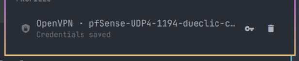

# OpenVPN Manager for Omarchy

[](https://github.com/debba/omarchy-openvpn-widget/actions/workflows/test.yml)
[](LICENSE)

A native [Omarchy](https://omarchy.org/) bar widget for managing OpenVPN profiles through NetworkManager. Connect, disconnect, rename, and manage credentials without leaving the bar.

<p align="center">
  
</p>

## Highlights

- Discovers `.ovpn` and `.conf` profiles from a configurable directory.
- Imports a profile into NetworkManager only when it is first used.
- Provides a dedicated **Connect** action for inactive profiles.
- Shows only the **Disconnect** action while a profile is active.
- Supports custom display names without renaming configuration files.
- Stores credentials in the desktop Secret Service keyring.
- Integrates with Omarchy's bar settings and current theme.
- Refreshes connection state automatically.

## Security

Passwords are never stored in `shell.json`, the plugin state file, or command-line arguments.

Credentials are saved through `secret-tool` as Secret Service items. During activation, the password is written to a temporary file with mode `0600`, passed to NetworkManager, and immediately removed. The NetworkManager profile is then cleared of the persisted username as well.

The local state file is stored at:

```text
~/.local/state/omarchy-openvpn-widget/profiles.json
```

It contains only profile paths, NetworkManager UUIDs, and custom display names.

## Requirements

- Omarchy with the Quickshell plugin API
- NetworkManager
- OpenVPN
- `networkmanager-openvpn`
- `libsecret`
- An active Secret Service provider, such as GNOME Keyring

The included installer installs the required packages through `omarchy pkg add`.

## Installation

### Omarchy plugin manager

```bash
omarchy pkg add openvpn networkmanager networkmanager-openvpn libsecret gnome-keyring
omarchy plugin add https://github.com/debba/omarchy-openvpn-widget.git --enable
```

The widget defaults to the right section of the bar. If necessary, move it explicitly:

```bash
omarchy bar move community.openvpn --section right
```

### Install from a clone

```bash
git clone https://github.com/debba/omarchy-openvpn-widget.git
cd omarchy-openvpn-widget
./install.sh
```

The installer validates the plugin, copies it into the Omarchy user plugin directory, and enables it in the right section of the bar.

## Configuration

1. Place the provider's `.ovpn` or `.conf` files in `~/.config/openvpn`.
2. Alternatively, open the Omarchy bar settings and change **OpenVPN configuration directory**.
3. Open the shield icon in the bar.
4. Use the connect icon beside a profile.
5. Enter the VPN username and password when prompted.

The profile list is scanned non-recursively. Certificate and key paths referenced by an OpenVPN file must remain valid after NetworkManager imports it.

### Profile actions

When a profile is disconnected, the widget provides actions to:

- connect;
- assign a custom display name;
- save or replace keyring credentials;
- forget the imported NetworkManager profile and its credentials.

When a profile is connected, these actions are replaced by a single disconnect button.

Forgetting a profile does **not** delete or modify the original `.ovpn` or `.conf` file.

## Widget settings

| Setting | Default | Description |
| --- | --- | --- |
| `configDirectory` | `~/.config/openvpn` | Directory containing OpenVPN profiles |
| `refreshIntervalSec` | `10` | Connection-state refresh interval in seconds |

## Development

Run the backend tests and validate the plugin:

```bash
python -m unittest discover -s tests -v
omarchy plugin validate .
```

For live development, link the repository into the user plugin directory:

```bash
ln -sfn "$PWD" ~/.config/omarchy/plugins/community.openvpn
omarchy plugin enable community.openvpn --section right
omarchy restart shell
```

## Uninstallation

```bash
./uninstall.sh
```

The uninstall script removes only the widget. Imported NetworkManager profiles, keyring entries, and system packages are intentionally preserved.

## License

Released under the [MIT License](LICENSE).
